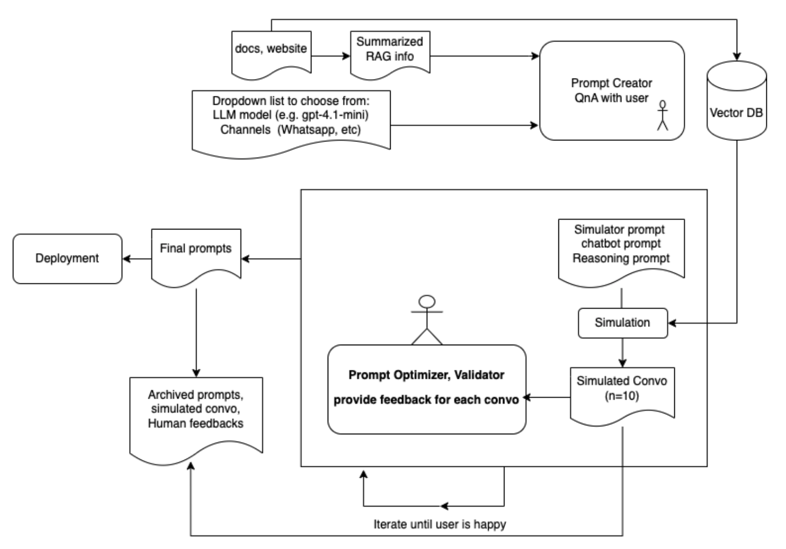

# Chatbot Creator (in development)
An application that is able to create and optimize chatbot with users' instructions, built on top of the edu_chatbot project

## Architecture

  

## Progress update (20May2025)
* For main Chatbot app:
  1. Deployed vector database on Google Compute Engine, setup firewall configuration
  2. In the process of configuring and deploying data ingest and backend (inferencing) pipeline via Cloud build and Choud run.
* For Chatbot Creator app: working on POC with gradio as temporary frontend. 

## Reference & Thoughts
* [MARK: Memory Augmented Refinement of Knowledge](https://arxiv.org/abs/2505.05177)
* 